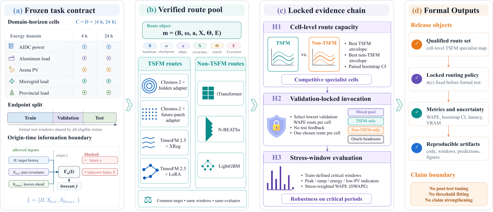

# TSFM Routing: Route-Level Qualification Protocol for Multi-Energy TSFM Forecasting



Reproducibility package for the paper submitted to the *Applied Energy* special issue on large models for next-generation energy systems.

## Overview

This repository provides the source code and canonical data required to reproduce **all** tables (1--5) and figures (2--8) in the manuscript. The protocol treats time-series foundation models (TSFMs) as forecasting **routes** that must be qualified before operational use, evaluating them alongside competitive non-TSFM baselines under a locked, leak-free evaluation framework.

### Hypothesis Chain

| Layer | Question | Section |
|-------|----------|---------|
| **H1** | Can TSFM routes compete with non-TSFM routes at the cell level? | 3.2 |
| **H2** | Does a validation-locked mixed-pool routing policy outperform fixed-family baselines? | 3.3 |
| **H3** | Does the advantage hold under train-defined stress-window weighting? | 3.4 |

### Energy Domains

| Domain | Resolution | Duration | Target |
|--------|-----------|----------|--------|
| AI data-center power | 15 min | 3.5 months | Aggregate GPU power |
| Aluminum load | 15 min | 5 months | Industrial active power |
| Arena PV | 15 min | 7 months | PV output power |
| Microgrid load | 10 min | 2 years | Microgrid total load |
| Provincial load | 15 min | 2 years | Provincial grid load |

### Model Routes

| Family | Type | Adaptation |
|--------|------|------------|
| Chronos-2 (120M) | TSFM | Hidden adapter, future-patch adapter |
| TimesFM 2.5 (200M) | TSFM | XReg, LoRA |
| iTransformer | Deep sequence | Supervised full-train refit |
| N-BEATSx | Deep sequence | Supervised full-train refit |
| LightGBM | Tree model | Tuned tabular refit (CPU) |

## Requirements

- Python 3.11+
- CUDA-capable GPU (all models except LightGBM require GPU)
- ~50 GB disk space for results

```bash
pip install -r requirements.txt
```

**TSFM checkpoints** are downloaded automatically from HuggingFace on first use:
- `amazon/chronos-2`
- `google/timesfm-2.5-200m-pytorch`

## Repository Structure

```
tsfm_routing/
├── data/
│   ├── energy_tsfm_canonical/           # Canonical parquet data (5 domains, ~34 MB)
│   ├── energy_tsfm_formal_windows/      # Pre-computed formal window membership (~71 MB)
│   ├── energy_tsfm_tuning/              # H2/H3 policy locks, execution lock tables
│   └── energy_tsfm_dev_subsets/         # Development subset manifests
├── config/
│   ├── energy_tsfm_model_registry.json  # Model registry (70 KB)
│   └── routes/                          # Per-route hyperparameter configs (77 files)
├── scripts/                             # 28 Python scripts
├── figures/                             # Output directory for generated figures
├── results/                             # Output directory (populated by scripts)
├── .gitignore
├── LICENSE
├── requirements.txt
└── README.md
```

## Full Reproduction Pipeline

The reproduction follows a strict sequential chain. Each step depends on outputs from the previous step.

### Step 1: Data Preparation

Build the segment-safe canonical data (P1b) and frozen window indices (P1c) from the provided canonical parquet files:

```bash
# P1 → P1b: segment-safe quality filtering
python scripts/build_energy_tsfm_p1b_quality.py

# P1b → P1c: rolling window index generation (4h and 24h horizons)
python scripts/build_energy_tsfm_p1c_window_index.py
```

### Step 2: Model Training and Test-Once Prediction

Train all 57 model routes and generate formal test predictions. This is the most computationally expensive step (requires GPU, takes hours to days depending on hardware).

The main orchestrator dispatches each locked route:

```bash
# Execute the full locked P5 test-once queue
python scripts/run_p5_locked_queue_executor.py \
    --lock-csv config/locks/execution_lock.csv \
    --approval-token P5_TEST_ONCE_APPROVED_20260517
```

Individual model families can also be run separately via `run_p5_main_test_once.py`:

```bash
# Example: single route
python scripts/run_p5_main_test_once.py \
    --model itransformer \
    --domain aidc_power_optional \
    --horizon 24h \
    --config-source config/routes/itransformer_aidc_power_optional_24h.json \
    --split test \
    --full-train-refit \
    --run-id p5_itransformer_aidc_power_optional_24h_codex_locked \
    --device cuda
```

### Step 2.5: Aggregate Test-Once Results

After all routes have completed, aggregate per-route metrics into the summary tables needed by downstream scripts:

```bash
python scripts/build_p5_test_once_summary.py
```

### Step 3: H2/H3 Policy Evaluation

Apply the validation-locked H2 routing policy and H3 stress-weighted evaluation to the test predictions:

```bash
python scripts/build_p5_h2_h3_test_application.py
```

### Step 4: Result Package Assembly

Aggregate results into manuscript-facing tables:

```bash
# Build Tables 1--3 and S1
python scripts/build_p5_manuscript_result_package.py

# Build bootstrap CIs, cost benchmarks, threshold sensitivity (Table 5, supplementary)
python scripts/build_manuscript_repair_audit_and_statistics.py
```

### Step 5: Figure Generation

Generate all manuscript figures from the assembled results:

```bash
# Figures 2--6, 8
python scripts/build_revised_figures.py

# Figure 7 (representative forecast traces)
python scripts/build_fig7_representative_trace.py
```

### Step 6 (Optional): Late TSFM Extension

Reproduce the chronology-separated TSFM extension results (Section 4.5):

```bash
python scripts/run_p6_late_tsfm_extension_queue.py
python scripts/summarize_p6_late_tsfm_extension.py
```

## Data

The `data/energy_tsfm_canonical/` directory contains the canonical parquet files for all five energy domains. These are the processed, anonymized datasets at their operational resolution (10--15 min). All downstream data products (P1b segments, P1c window indices, formal windows) are deterministically regenerated from these files by Step 1.

### Data Provenance

| Domain | Source | License |
|--------|--------|---------|
| AI data-center power | ACMetrace GPU telemetry | Academic use |
| Aluminum load | Industrial plant records | Authorized for release |
| Arena PV | AEMO/Arena public dataset | Public |
| Microgrid load | TwInSolar microgrid dataset | Published academic |
| Provincial load | Regional grid + meteorological records | Authorized for release |

## Configuration

- `config/energy_tsfm_model_registry.json` — Full model registry with variant definitions, license tracking, and audit status.
- `config/locks/` — Pre-test frozen policy tables (H2 validation winners, H3 stress thresholds, route-level locks).
- `config/routes/` — Per-route hyperparameter configurations extracted from validation-phase manifests. Each JSON contains the exact `best_params` used in the formal test-once run.

## Key Design Principles

1. **Test-once discipline**: The formal test set is touched only after all model and policy decisions are frozen.
2. **Leak-free windows**: No forecasting window crosses train/validation/test boundaries.
3. **Segment safety**: Windows never span temporal gaps in the source data.
4. **CUDA mandate**: All deep learning and TSFM artifacts run on GPU (LightGBM is the sole CPU exception).
5. **No post-test tuning**: No threshold, configuration, or model selection is adjusted after observing test results.

## Citation

```bibtex
@article{xxx2026tsfm_routing,
  title={Route-Level Qualification Protocol for Multi-Energy TSFM Forecasting},
  author={xxx},
  journal={Applied Energy},
  year={2026}
}
```

## License

This project is licensed under the MIT License. See [LICENSE](LICENSE) for details.
